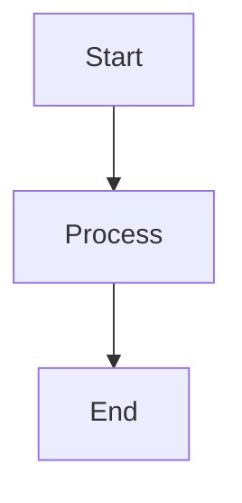

# Folia

<div align="center">
  
  <p><strong>A fast, offline, cross-platform markdown viewer with full HTML support, Mermaid diagrams, interactive tables, and note-taking</strong></p>
</div>


---

## What Folia is

Folia opens markdown files and renders them the way the author wrote them -
including embedded HTML, Mermaid diagrams, sortable tables and syntax-highlighted
code - and lets you annotate, edit and export without leaving the window.

It works **entirely offline** as a viewer. Every library it renders with is
vendored into the application at install time; nothing is fetched from a CDN at
runtime, and no feature sends your document anywhere. Two things do reach the
network, both stated plainly rather than buried: an update check against this
project's own releases feed (see [Installation](#installation)), and any image
your own document points at with an `https:` URL — that one is your document's
doing, and it is a deliberate trade so that remote images in markdown keep
working.

### Provenance

Folia is an independent fork of
[yumedzi/markdown-viewer](https://github.com/yumedzi/markdown-viewer) by Viktor
Moyseyenko, itself a fork of the original
[OmniCoreST/omnicore-markdown-viewer](https://github.com/OmniCoreST/omnicore-markdown-viewer)
by Omnicore. Both are MIT-licensed, and their authors' copyright notices are
retained in [`LICENSE`](LICENSE.txt) as MIT requires - which is why that file names
three parties. Folia is maintained separately, with its own name and version
series, and is **not** published, endorsed or supported by Omnicore.

Folia diverged from its parent at commit **`854bdec`** (2026-02-23, upstream
v2.0.7). It is a fork, not a downstream branch: upstream commits are reviewed
and picked deliberately rather than merged wholesale, because a merge that looks
like a clean improvement can silently undo a fix here. What the fork changed,
and why, is recorded in [`CUSTOMIZATIONS.md`](https://github.com/lostinsea/folia/blob/main/docs/CUSTOMIZATIONS.md)
precisely so that the next merge has something to check against.

---

## What changed in Folia

Folia is not a rebrand of its parent. The list below is the substantive work,
and every item is covered by tests in this repository.

### The bug that started it

Opening several files as tabs and refreshing one of them **reverted the others**
to stale content. Refresh updated the on-screen DOM but never wrote the fresh
text back into the tab's own store, so switching away and back repainted the old
document. Fixed, along with five related defects found in the same area - among
them a missing `set-active-file` handler that left the file watcher pinned to
whichever file was opened first, so background tabs were never told their file
had changed.

Refreshing now also **remembers where you were reading** - by heading anchor
rather than pixel offset, so the position survives the document reflowing.

### Security

A full audit produced 27 findings, all of which are resolved or recorded as
measured, justified deferrals in [`SECURITY-AUDIT.md`](https://github.com/lostinsea/folia/blob/main/docs/SECURITY-AUDIT.md).
The substantive ones:

- Every HTML sink that took document-controlled text was rebuilt from DOM nodes and `textContent`. In a Node-privileged renderer these are code execution, not defacement.
- `<form>` is stripped by the sanitizer and navigation is blocked on the main window, so a crafted document cannot replace the application with a remote page.
- `<iframe src="https://...">` survived sanitization and silently fetched a remote page on render. Found during review, not in the audit. The `src` is now stripped and subframe loads are blocked as a second layer.
- Links to local files go through an extension policy: executables and macro-enabled Office documents are refused outright, inert documents open directly, anything else asks first. UNC and protocol-relative paths are rejected **before** the app touches the filesystem, because the existence check was itself an outbound SMB probe that leaked an NTLMv2 challenge/response.
- Inline CSS in documents is normalised through the browser's own parser before filtering, after a regex-based filter was shown to have three separate bypasses.
- Document translation has been removed. It sent the text of whatever you were reading, in pieces, to a third-party endpoint; nothing in the app now makes an outbound request carrying document content, and the renderer's `connect-src` is `'none'`.

### Performance

Measured before and after; method and raw numbers in
[`PERF-AUDIT.md`](https://github.com/lostinsea/folia/blob/main/docs/PERF-AUDIT.md)
and [`bench/BASELINE.md`](https://github.com/lostinsea/folia/blob/main/bench/BASELINE.md).

**Two of the app's own rendering passes were quadratic.** Nobody had noticed,
because nobody had measured a large document. On a benchmark corpus that is
generated deterministically and hash-pinned in this repository, so the numbers
can be reproduced rather than taken on trust:

| Document | Before | After |
|---|---:|---:|
| 1 MB | 41.3 s | 5.0 s |
| 2 MB | 187.1 s | 7.8 s |

The 2 MB case is the tell: **4.5x the time for 2x the work** is not a slow
function, it is the wrong shape. Both passes are now near-linear across the
sizes that matter, so a document twice the size costs roughly twice as much
rather than four times.

- **Markdown parser upgraded (marked 9 -> 18)**, which removed a cliff of its own: a 2.5 MB table-heavy file went from **34.3 s to 0.40 s** to parse.
- **~545 ms of blocking startup work removed** - two heavyweight modules were loaded at module scope on every launch and are now loaded on first use.
- **Mermaid is loaded lazily**, cutting a further ~125 ms from launches of documents that contain no diagrams.
- **Incremental rendering made to actually work.** Editing now patches only the affected nodes using a keyed diff, so inserting a paragraph mid-document no longer rebuilds everything after it.
- Search is debounced, and it no longer counts matches in detached nodes after a re-render.

**Folia now estimates what a document will cost before rendering it**, and asks
first if that looks like more than ten seconds. The estimate deliberately does
*not* use file size: at an identical 1 MB, documents in the benchmark corpus
span 260 ms to 3.4 s of render time, which makes bytes a **12.9x-wrong** proxy.
The obvious replacement - line count - measured *worse* (26.9x). The signal
actually used is derived from measurement and validated on profiles it was not
fitted to.

### Tables

Wide tables were unreadable: a fixed layout gave every column the same width, so
a description column got 25% of the space and wrapped into a tall thin ribbon.
Tables are now content-sized, and a table that is cramped inside the reading
column is allowed to break out of it - while prose columns stay capped at a
comfortable measure. The cap is **typographic, not a pixel constant**: it is
resolved at runtime by measuring the real font, so it holds across display
scaling and font settings.

### Other fixes

- Diagrams no longer blur when zoomed in the pop-out viewer.
- One invalid Mermaid diagram no longer prevents every later diagram in the document from drawing.
- Jumping to a heading landed in the wrong place when zoomed in split view.
- Ordered lists no longer clip three- and four-digit markers.
- Exiting edit mode with unsaved changes now discards them, and says so - previously it neither kept nor discarded them, and the next edit silently destroyed the text.
- Saving while a save was already in flight could write the wrong bytes; saves are now serialised per file and correlated by request id.
- A dialog opened in a short window could be taller than the window itself, putting its own buttons out of reach with nothing able to scroll to them. The Mermaid and table dialogs are now capped to the window and resizable.
- Editing selected text in place failed when the selection began or ended inside bold or italic markers.
- A raw-HTML block was silently mis-parsed if its opening fence carried a trailing space or tab, so it rendered as mangled prose rather than in its sandboxed frame.

### Housekeeping

- Dependencies: **24 known vulnerabilities to 0**; Electron upgraded to 43.2.0, Node to 24.18.1, Mermaid to 11.
- Third-party licence notices are **generated from the lockfile** and shipped in the installer - see [`THIRD-PARTY-NOTICES.md`](THIRD-PARTY-NOTICES.md), covering every package that ships.
- **The installer stopped carrying 130 MB it never loaded.** The rendering libraries are vendored into the app and loaded from there, but every one of them was *also* being packaged a second time as an npm dependency. Removing the duplicates took `app.asar` from 153.6 MB to 23.2 MB, and the feature removals below have taken it down further since.
- Features that served one organisation's internal workflow, rather than a general-purpose viewer, were removed: two vendor-specific document modes, the bundled VS Code extension, document translation, the image slider and interface localisation. Export to Word went with them - it was roughly half the installer by itself, and PDF covers the same ground.

---

## Features

### Core rendering
- **Full HTML support** - HTML inside markdown, sanitized with DOMPurify
- **Mermaid diagrams** - all diagram types, with an interactive pan/zoom pop-out viewer
- **Syntax highlighting** - PrismJS, offline, 11+ languages
- **Interactive tables** - Tabulator integration with sorting, filtering, pagination and CSV/JSON export

### Tabs
- Open several files at once; tabs appear automatically from the second file
- Each tab shows an unsaved-changes dot and is independently closable
- Open tabs are restored on next launch
- Switching tabs restores your reading position
- A background tab whose file changed on disk reloads quietly on arrival; the tab you are actually reading asks first

### Editing and export

Document editing lives in **edit mode**. In view mode the document is read-only,
so a right-click on something you are only reading cannot alter the file. There
is one deliberate exception - notes, which are available in both modes and save
themselves the moment you confirm them.

- **Live editor** - split view with a debounced preview, and a draggable splitter between the two panes
- **Inline editing** - right-click any selected text and edit it in place, instead of hunting for it in the source. It works even when the selection spans bold or italic markers.
- **Undo / redo** while editing
- **PDF export** - forced to light colours so output is printer-friendly regardless of theme
- Unsaved-changes indicator. Leaving edit mode with unsaved changes discards them, and says so before it does.

### Mermaid and table dialogs

Right-click anywhere to insert or edit a diagram or table without writing the
markup by hand. Insert, edit and delete are all available for both.

<div align="center">
  
  <p><em>Mermaid insert dialog — choose from 12 templates, edit code on the left, see the live diagram on the right</em></p>
</div>

<div align="center">
  
  <p><em>Table insert dialog — set rows, columns, and header row; preview updates instantly before inserting</em></p>
</div>

### Notes

Select text and annotate it. Notes render as a coloured highlight with a tooltip.

- Text notes, image notes and free-floating label badges
- An **All Notes** panel listing every note, with search
- Show / hide all notes; edit and delete from the context menu
- Six colours
- Notes work in view mode as well as edit mode, and a note made in view mode is written to the file as soon as you confirm it - view mode has no Save button to press, so an unsaved note would be a note you lose on close

<div align="center">
  
  <p><em>Notes appear as colored highlights with a tooltip showing the note title and content on hover</em></p>
</div>

### Right-click menu

<div align="center">
  
  <p><em>Right-click context menu in edit mode, with formatting, note management, diagram and table options</em></p>
</div>

The menu adapts to the mode you are in.

- **Always available** - copy, copy as plain text, select all, copy a code block, copy an image source, and the full set of note commands (add, edit, delete, find).
- **Edit mode only** - inline formatting (bold, italic, code, list, remove formatting), Edit Text, insert and edit and delete for Mermaid diagrams and tables, insert image, and delete image for embedded images.

### Navigation and UI
- **File / View / Tools** menus
- **Drag and drop** - drop a markdown file onto the window to open it
- **Table of contents** - hierarchical, H1-H6, one click to jump, current section highlighted
- **Search** with live highlighting, match counter and keyboard navigation (Ctrl+F)
- **Themes** - Light, Dark, or follow the desktop's appearance in real time, each with a choice of colour scheme under **View > Themes**: Default Light, Clarity and Parchment for light; Default Dark, Abyss and Ember for dark. Folia remembers a scheme per mode, so following the desktop switches between your chosen light and dark schemes rather than a fixed pair.
- **Zoom** - 50% to 400%
- **Collapsible headings** - fold and unfold sections, individually or all at once
- **Recent files** - the last 100
- **OS-level file watching** - external changes are noticed immediately, without polling
- The Mermaid and table dialogs are resizable, and never taller than the window they open in
- Click the file path to copy it

---

## Installation

### Download

Releases are published at
[lostinsea/folia/releases](https://github.com/lostinsea/folia/releases).

| Platform | File | Description |
|----------|------|-------------|
| Windows | `Folia-Setup-X.X.X.exe` | Installer |
| Windows | `Folia X.X.X.exe` | Portable, no installation |
| macOS | `Folia-X.X.X.dmg` | Disk image |
| Linux | `Folia-X.X.X.AppImage` | Portable AppImage |
| Linux | `folia_X.X.X_amd64.deb` | Debian / Ubuntu package |

Only the Windows installer registers file associations; the portable build and
the other platforms are launched directly.

> **"Windows protected your PC"**
>
> Folia is not code-signed, so SmartScreen will warn on first run. Click
> **More info**, then **Run anyway**. The source is in this repository and the
> installer can be rebuilt from it.

Folia checks for updates against this fork's own GitHub releases feed: once a
few seconds after launch in packaged builds, and on request from the menu. That
check downloads release *metadata* automatically — it has to, to know whether a
newer version exists — but it never downloads or installs the update itself
without asking.

The request is deliberately uninformative. It does not carry the current
version at all: the published version is fetched and compared locally.
`electron-updater` would normally attach `x-user-staging-id`, a random
identifier it persists to disk and reuses forever, which would make every check
from one machine linkable to every other; Folia blanks that header
(`configureAutoUpdater` in `main.js`, proven on the wire by `npm run
test:startup`). What remains is a plain HTTPS GET with a
`User-Agent: electron-builder` header. No document, no file path, no usage
data. GitHub necessarily sees the connecting IP address, as it would for any
download.

This is the only connection Folia opens on its own initiative. There is
currently no setting to turn it off; unpackaged (development) runs never check
at all.

### Build from source

**Prerequisite: Node.js 24.18.1 or newer.** The exact version this project is
developed against is in [`.nvmrc`](https://github.com/lostinsea/folia/blob/main/.nvmrc).

Electron 43 downloads its binary lazily on first run using a downloader that
is ESM-only and needs Node >= 22.12. So that this does not surface as a confusing
failure at `npm start`, `.npmrc` sets `engine-strict=true` and an unsupported
Node fails fast at install with an explicit `EBADENGINE`. (Electron bundles its
own Node, so this applies to the build toolchain only, never to the running
application.)

```bash
nvm use          # fnm, nvs, Volta and nvm on macOS/Linux all read .nvmrc
```

```powershell
# nvm-windows does not read .nvmrc, so pass the version explicitly
nvm install (Get-Content .nvmrc)
nvm use (Get-Content .nvmrc)
```

```bash
npm install      # also vendors marked, Mermaid, DOMPurify and Fira Code
npm start
```

`npm install` runs `scripts/vendor-libs.js`, which copies the runtime libraries
and fonts out of `node_modules` into `libs/vendor/` and `fonts/`. Those
directories are generated, not committed. The application loads them from disk
and deliberately fetches nothing at runtime, so it renders fully offline and the
versions you audit are the versions you ship.

### Build installers

```bash
npm run build            # portable .exe
npm run build-installer  # NSIS installer
npm run build-all        # both
npm run build-linux      # AppImage + .deb
npm run build-mac        # .dmg
```

Output lands in `dist/`. See [`BUILD.md`](https://github.com/lostinsea/folia/blob/main/docs/BUILD.md) for the full guide and
[`RELEASE.md`](https://github.com/lostinsea/folia/blob/main/docs/RELEASE.md) for the release process.

---

## Controls

### Keyboard

| Shortcut | Action |
|----------|--------|
| `Ctrl+O` | Open file |
| `Ctrl+R` | Refresh from disk |
| `Ctrl+S` | Save (edit mode) |
| `Ctrl+Z` / `Ctrl+Y` | Undo / redo (edit mode) |
| `Ctrl+F` | Search |
| `Ctrl++` / `Ctrl+-` / `Ctrl+0` | Zoom in / out / reset |
| `Ctrl+Enter` | Confirm in dialogs |
| `Enter` / `Shift+Enter` | Next / previous search match |
| `Escape` | Close search or dialog |
| `F11` | Fullscreen |
| `F12` | Developer tools — see below |
| `Tab` | Insert two spaces (editor) |

On macOS, use `Cmd` in place of `Ctrl`.

`F12` opens developer tools when Folia is run from source. **In an installed
build it does nothing**, unless the app is started with `FOLIA_DEVTOOLS=1` in
the environment. That is deliberate: the renderer has full Node access, so the
developer console can read and write any file you can, and "press F12 and paste
this" is a well-worn way to talk someone into running code they never meant to.
An environment variable cannot be triggered by a keystroke, so the diagnostic
stays available to anyone who actually wants it while the shoulder-surfing
route closes.

Bold, italic, code and the other formatting commands have no shortcut — they
live in the right-click menu, in edit mode. Dark mode is toggled from the
toolbar, not the keyboard.

### Mouse
- **Ctrl + wheel** - zoom
- **Right-click** - context menu

---

## Supported files

`.md`, `.markdown`, `.mdown`, `.mkd`, `.mkdn`, and Mermaid files
(`.mmd`, `.mermaid`).

Open them with `Ctrl+O`, from the recent-files list, or by dragging them onto the
window.

The installer registers Folia as a handler for `.md`, `.mmd` and `.mermaid`
only, so those are the three that appear under **Open with** without being
added by hand. The other extensions open perfectly well — the restriction is
about which types the installer claims in the shell, not which types Folia can
read.

---

## Mermaid

Fenced `mermaid` blocks are rendered automatically:

````markdown

````

Right-click and choose **Insert Mermaid** to start from one of 12 templates.
Click a diagram's pop-out button to pan and zoom it in its own window.

---

## Technology

| Component | Version | Role |
|-----------|---------|------|
| Electron | 43.4.1 | Desktop runtime |
| marked | 18.0.10 | Markdown parser |
| Mermaid | 11.17.0 | Diagram rendering |
| DOMPurify | 3.4.14 | HTML sanitization |
| Tabulator | 6.5.2 | Interactive tables |
| PrismJS | 1.30.0 | Syntax highlighting |
| Fira Code | - | Application typeface |

Full licence texts for every shipped dependency are in
[`THIRD-PARTY-NOTICES.md`](THIRD-PARTY-NOTICES.md), which is generated from
`package-lock.json` by `npm run notices` and shipped inside the installer.

---

## Engineering

Folia's test suite is unusual, and it is unusual on purpose. Almost every defect
in the list above was invisible - the app looked like it was working. A suite
that only checks for the failures you already imagined will not find those.

**13 suites, ~1,850 assertions**, all driving the real application in a real
Electron window: real click events, real dialogs, real file writes, with the
rendered DOM or the bytes on disk as the oracle. Nothing asserts on the
implementation's own helper functions, because a test that asks the code what it
thinks it did will always be told it went fine.

**Every fix is proven by reverting it.** `scripts/prove-table-fixes.js` holds
**458 recorded defects**. Each one re-applies the original bug to the
source, runs the suite, and requires it to fail on *that fix's own named
assertions* - not merely to fail. A revert that fails nothing means the test was
decorative; a revert that fails too much means the test is not specific enough.
276 of them additionally name assertions that **must keep passing**, so a fix
cannot be "proven" by a test that simply breaks everything.

This has repeatedly caught tests that could not fail:

- an assertion that judged a geometry formula using **a copy of that same formula**;
- a probe that measured the same value for every input, because an unrelated CSS rule pinned it;
- a shipped-documentation check that passed with the mechanism it described **commented out**;
- a whole block of packaging assertions that silently **stopped running** and still reported green.

Alongside that: a benchmark harness with **315 structural checks** on its own
measurements (so the instrumentation cannot quietly stop recording, which it
once did), a console-error sentinel with an audited mute list, a visual-probe
layer with its own self-check that demonstrates all six of its failure modes,
and screenshots treated strictly as artifacts for a human to look at - never as
pass/fail baselines.

The working rule behind all of it: **measure, don't reason.** Several fixes here
replaced a confident and entirely wrong explanation, including some of my own.

---

## Where this is going

Folia is deliberately narrower than what it forked from. The parent is a
general-purpose viewer that accumulated diagram engines, document modes and
export formats; Folia gives that space back. Vendor document modes, the bundled
VS Code extension, translation, localisation and Word export are gone, and two
upstream features - a second diagram system and circuit schematics - were
evaluated and declined rather than skipped. The installer went from **153.6 MB
to well under a quarter of that**.

The philosophy is **leaner and faster, and offline**. Folia makes no network
requests: every library it renders with is vendored inside the app, so it works
identically on an air-gapped machine and there is no telemetry to opt out of.

Planned next:

- Bring the removal-path rendering work to the same linear shape as the rest (a document-to-document swap with partial reuse is still super-linear).
- Table breakout is now the single most expensive pass on wide documents; it is the next performance target.
- Signed Windows builds, so installing does not require dismissing SmartScreen.
- Continue reviewing upstream commits individually - each one measured against this fork before it is taken.

---

## Development

```bash
npm install
npm start
npm test          # the full suite
```

Individual suites are available as `npm run test:tabs`, `test:security`,
`test:tables`, `test:mermaid`, `test:packaging` and others - see
`package.json`.

The two conventions described under [Engineering](#engineering) - every fix is
proven by reverting it, and measure rather than reason - are not aspirations;
a change that does not follow them will not pass review here. The full working
guide, including the traps this codebase is known to set, is in
[`.github/copilot-instructions.md`](https://github.com/lostinsea/folia/blob/main/.github/copilot-instructions.md).

[`CUSTOMIZATIONS.md`](https://github.com/lostinsea/folia/blob/main/docs/CUSTOMIZATIONS.md) documents the overlay files
(`custom-*.js`) inherited from the intermediate fork.

---

## Contributing

Issues and pull requests are welcome. Please run `npm test` before opening a
pull request, and add a test for anything you fix.

---

## License

MIT - see [`LICENSE`](LICENSE.txt).

Folia retains the copyright notices of the upstream authors as MIT requires.
Licence texts for all bundled third-party components are reproduced in
[`THIRD-PARTY-NOTICES.md`](THIRD-PARTY-NOTICES.md).

Maintained by **[lostinsea](https://github.com/lostinsea)**.
